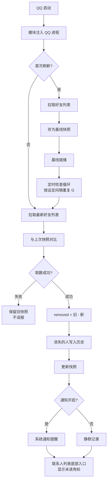

# 去TM的单向好友

FuckQQ-NullFriend 是一个 LSPosed 模块，用于检测 QQ 好友列表中消失的联系人。它定期拉取好友列表并与本地基线对比，记录减少的人，让你知道是谁、大约何时消失的。

QQ 本身不会提示你被谁删除。这个模块用最直接的方式解决这个问题：存下每次的好友列表，下次再取，对比差异。

> 检测逻辑为独立重新实现，未搬用老版「历史好友」模块中已失效的钩子。

## 功能

- 启动后读取当前登录号的好友列表，存为本地基线
- 每次刷新与上次快照对比，只记录减少的人
- 入口位于 QQ 联系人列表底部（与 QNotified 历史好友位置相同），无全局悬浮窗
- 面板内支持搜索、筛选未读、导出文本
- 长按记录可尝试打开对应聊天页，查看本地会话是否仍存在
- 系统通知默认关闭，可手动开启
- 定时检查默认关闭，需先手动刷新建立基线后才能设定，间隔可选 30 分、1 小时、3 小时、半天
- 多账号独立隔离，按 QQ 号分别管理快照与历史
- 界面采用 ark-ui 设计语言，近黑底配信号青，方形几何

## 工作原理

模块运行在 QQ 进程内。每次获取好友列表后存为快照，下次获取时与旧快照做集合差，差值即为消失的好友，写入历史记录。取数失败时保留旧快照不覆盖，避免误报「全员被删」。



## 要求

- Android 8.0 及以上
- LSPosed 或兼容框架
- 作用域仅 `com.tencent.mobileqq`，不要勾选其他应用
- QQ 以官方 9.x NT 版本为主，小版本升级可能需要更新适配

## 安装

1. 安装 LSPosed，确认对 QQ 生效
2. 安装本模块 APK
3. 在 LSPosed 中启用模块，作用域仅勾选 QQ
4. 强制停止 QQ 后重新打开，此步骤必需
5. 打开入口，二选一：
   - QQ 联系人页，列表底部「单向好友」入口（推荐）
   - 桌面图标「去TM的单向好友」，点击「打开 QQ 并唤起面板」
6. 在面板中点击「立即刷新」建立基线，首次刷新不会报删除

如果看不到入口，先确认作用域已勾选 QQ、模块已启用、QQ 已强制停止。仍不行可用 `adb logcat -s FuckQQNullFriend` 查看是否存在 `Loading in com.tencent.mobileqq` 日志。

## 隐私

- 好友数据与历史仅存于本机 QQ 私有目录下的模块数据库
- 不上传，无统计，无广告
- 无法区分「对方删除你」与「你删除对方」，列表仅识别减少项，界面也会如实说明

## 构建

```bash
# JDK 17+，Android SDK
./gradlew :app:assembleDebug
# 输出: app/build/outputs/apk/debug/
```

Windows：

```powershell
.\gradlew.bat :app:assembleDebug
```

正式签名构建：`./gradlew :app:assembleRelease`。签名配置通过 `local.properties`（已 gitignore）读取，keystore 需自行生成。

## 更新日志

- v0.3.1：定时按钮标签改为「定时：关闭」等带前缀形式，更易识别；桌面启动器底部新增作者与仓库跳转
- v0.3.0：UI 整体重做为 ark-ui 风格；移除全局悬浮窗，入口改为联系人列表底部注入（参考 QNotified）；原生 ProgressBar、Spinner、AlertDialog 全部替换为自定义组件；定时检查新增「半天」间隔与基线限制；新增应用图标
- v0.2.1：初版进程内面板与悬浮窗入口

## 文档

- 设计：[docs/superpowers/specs/2026-07-12-qq-friend-deletion-detector-design.md](docs/superpowers/specs/2026-07-12-qq-friend-deletion-detector-design.md)
- 实现计划：[docs/superpowers/plans/2026-07-12-fuckqq-nullfriend.md](docs/superpowers/plans/2026-07-12-fuckqq-nullfriend.md)

## 免责声明

- 仅供个人学习与研究，请遵守当地法律法规与腾讯用户协议
- Hook 官方客户端存在封号、不稳定、兼容性风险，后果自负
- QQ 升级可能导致功能失效，需自行或等待社区更新适配

## License

MIT，见 [LICENSE](LICENSE)。

## 致谢

思路参考了开源 QQ 模块生态中 QAuxiliary 与 QNotified 的「列表对比」方向。本仓库为独立重写，未包含其已失效钩子的直接搬用。
